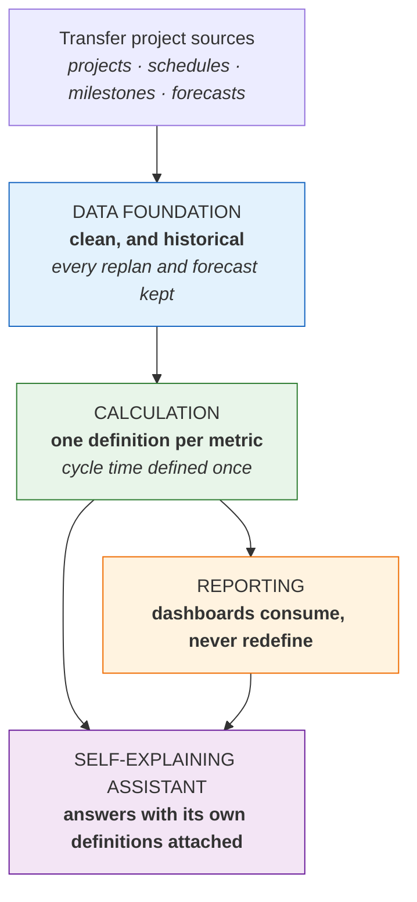
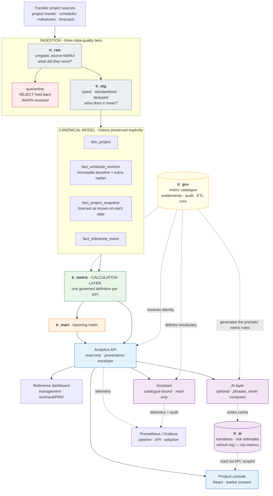
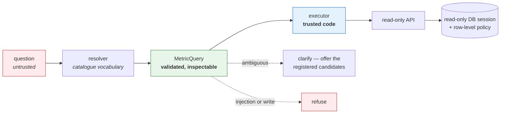
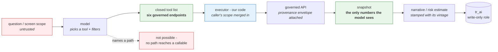

# Architecture

Two diagrams, for two audiences. Showing the wrong one is how a good design
conversation turns into a tooling conversation.

---

## For the business conversation

Five boxes. The only claim being made is that the layers are *separate*, and that
each one has a single job.

The sentence that goes with it:

> *"I separate source data, business calculation and presentation, so a metric
> like cycle time is defined once and reused everywhere. Then the AI sits on
> trusted metrics instead of raw tables."*

---

## For the engineering conversation

The arrow that is *missing* is the load-bearing one: nothing runs from `MODEL`
down to the warehouse. The AI layer holds no database handle, so it reaches every
figure through the same governed API the console calls, under the caller's
identity — and it writes its cache through a role that can write `tr_ai` and read
nothing.

### Why each boundary exists

| Boundary | The question it makes answerable |
| --- | --- |
| `tr_raw` / `tr_stg` | "Did the source send it wrong, or did we transform it wrong?" — answered by diffing two layers rather than by arguing |
| `fact_schedule_revision` | "How far has the plan moved from what we committed to?" — impossible once `planned_finish` is overwritten |
| `fact_project_snapshot` | "What did we believe three months ago?" — the only way forecast accuracy is measurable at controlled horizons |
| `tr_metric` | "Whose number is right?" — there is only one, and it is version-controlled |
| `tr_gov` | "What does this metric mean, who owns it, and who may see it?" |
| Analytics API | "Can BI and the assistant drift apart?" — no; they consume one contract |
| `tr_ai` | "Is this number governed, or is it a model's opinion?" — the schema boundary answers it, and no row here is registered as a metric |

### Enforcement

Entitlements are a **PostgreSQL row-level policy** on `tr_core.dim_project`, which
every metric view reaches through. Three things must hold together, and missing
any one leaves the policy installed but inert:

1. `FORCE ROW LEVEL SECURITY` — or the table owner bypasses its own policy.
2. A **non-superuser** connection — superusers bypass RLS unconditionally.
3. `security_invoker` on every view — or a view owned by the schema owner
   evaluates the policy as *its owner* and returns everything.

Fail-closed: an unset scope selects zero rows.

### The assistant's trust boundary

Every authority sits *below* the language layer. Claiming to be an admin in a
question buys nothing, because scope is resolved from identity before the
executor runs and enforced by the database.

### The model's trust boundary

The same shape, one level up, for the optional AI layer. The model chooses
*which* governed endpoint to call; it never chooses what a metric means.

Three consequences worth stating, because they are the whole reason a generated
paragraph is safe to print beside a governed number:

1. **The snapshot is fetched under the caller's identity**, so the row-level
   policy filters it before it is serialised into a prompt. A narrative cannot
   name a portfolio its reader may not see.
2. **Filters are merged, never replaced.** The screen's scope is applied on top
   of whatever the model asked for, so a question cannot widen a view.
3. **Output is stamped and expiring.** It carries the `data_as_of` it was written
   from and stops being served when a new load lands — because a briefing about
   last week's warehouse beside this week's chart is worse than no briefing.
