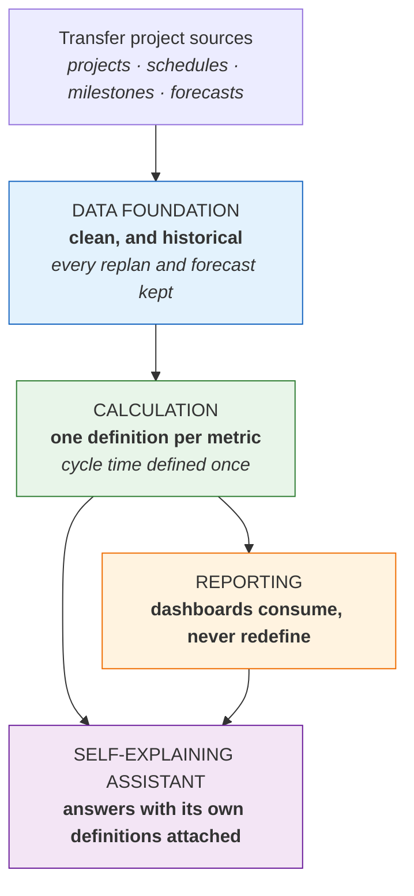
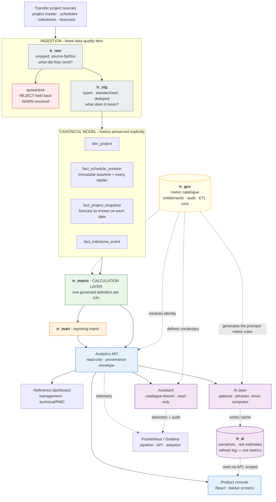
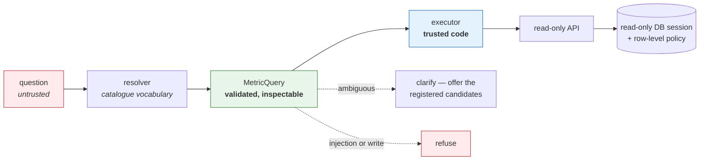
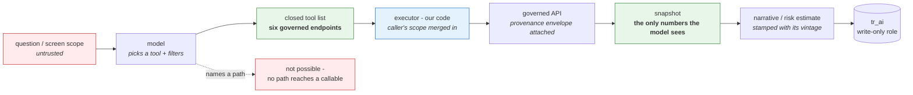
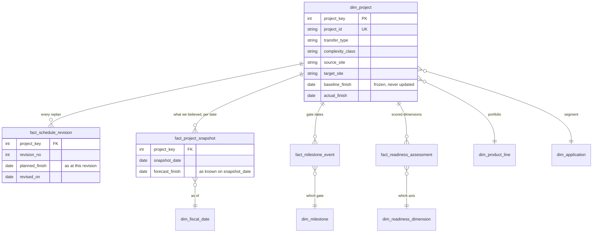
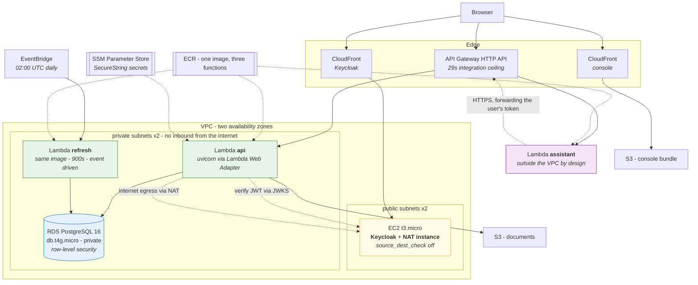
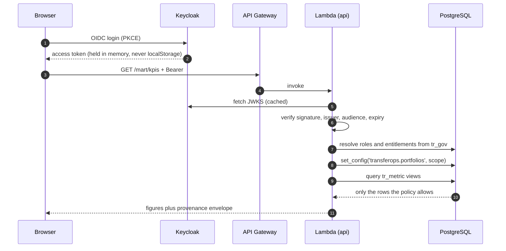
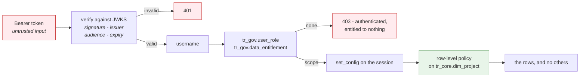
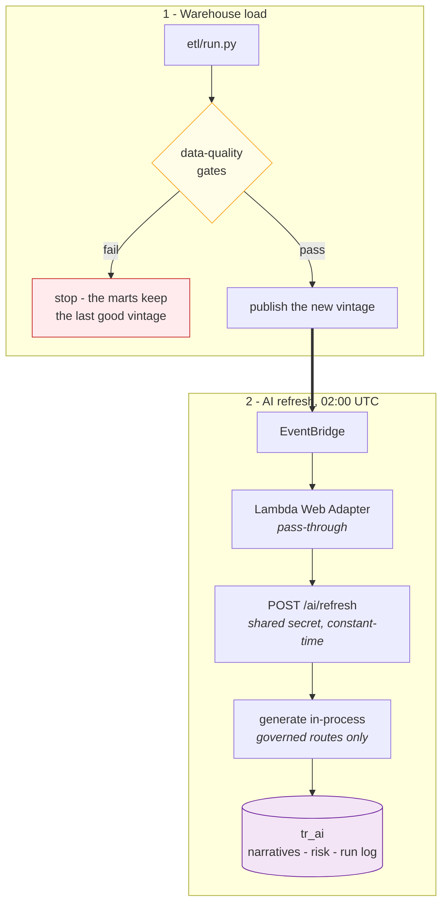
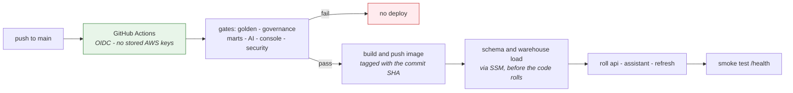

# Architecture

Two diagrams, for two audiences. Showing the wrong one is how a good design
conversation turns into a tooling conversation.

Those two come first because they are the ones worth arguing about. The rest of
this file is the same system seen from four other angles — the model it stores,
the machines it runs on, the path a single request takes, and the two pipelines
that keep it current. Each exists because someone eventually asks a question the
logical diagram cannot answer:

| View | The question it answers |
| --- | --- |
| [Business](#for-the-business-conversation) · [Engineering](#for-the-engineering-conversation) | "What are the layers, and why are they separate?" |
| [The core model](#the-core-model) | "Where does the history actually live?" |
| [Where it runs](#where-it-runs) | "What does this cost, and what is exposed?" |
| [The request path](#the-request-path) | "What happens between a click and a row?" |
| [Identity to row](#identity-to-row) | "Where exactly is a permission enforced?" |
| [The two pipelines](#the-two-pipelines) | "What runs on a schedule, and what happens when it fails?" |
| [How code ships](#how-code-ships) | "How does a commit become the running system?" |

---

## For the business conversation

Five boxes. The only claim being made is that the layers are *separate*, and that
each one has a single job.

The sentence that goes with it:

> *"I separate source data, business calculation and presentation, so a metric
> like cycle time is defined once and reused everywhere. Then the AI sits on
> trusted metrics instead of raw tables."*

---

## For the engineering conversation

The arrow that is *missing* is the load-bearing one: nothing runs from `MODEL`
down to the warehouse. The AI layer holds no database handle, so it reaches every
figure through the same governed API the console calls, under the caller's
identity — and it writes its cache through a role that can write `tr_ai` and read
nothing.

### Why each boundary exists

| Boundary | The question it makes answerable |
| --- | --- |
| `tr_raw` / `tr_stg` | "Did the source send it wrong, or did we transform it wrong?" — answered by diffing two layers rather than by arguing |
| `fact_schedule_revision` | "How far has the plan moved from what we committed to?" — impossible once `planned_finish` is overwritten |
| `fact_project_snapshot` | "What did we believe three months ago?" — the only way forecast accuracy is measurable at controlled horizons |
| `tr_metric` | "Whose number is right?" — there is only one, and it is version-controlled |
| `tr_gov` | "What does this metric mean, who owns it, and who may see it?" |
| Analytics API | "Can BI and the assistant drift apart?" — no; they consume one contract |
| `tr_ai` | "Is this number governed, or is it a model's opinion?" — the schema boundary answers it, and no row here is registered as a metric |

### Enforcement

Entitlements are a **PostgreSQL row-level policy** on `tr_core.dim_project`, which
every metric view reaches through. Three things must hold together, and missing
any one leaves the policy installed but inert:

1. `FORCE ROW LEVEL SECURITY` — or the table owner bypasses its own policy.
2. A **non-superuser** connection — superusers bypass RLS unconditionally.
3. `security_invoker` on every view — or a view owned by the schema owner
   evaluates the policy as *its owner* and returns everything.

Fail-closed: an unset scope selects zero rows.

### The assistant's trust boundary

Every authority sits *below* the language layer. Claiming to be an admin in a
question buys nothing, because scope is resolved from identity before the
executor runs and enforced by the database.

### The model's trust boundary

The same shape, one level up, for the optional AI layer. The model chooses
*which* governed endpoint to call; it never chooses what a metric means.

Three consequences worth stating, because they are the whole reason a generated
paragraph is safe to print beside a governed number:

1. **The snapshot is fetched under the caller's identity**, so the row-level
   policy filters it before it is serialised into a prompt. A narrative cannot
   name a portfolio its reader may not see.
2. **Filters are merged, never replaced.** The screen's scope is applied on top
   of whatever the model asked for, so a question cannot widen a view.
3. **Output is stamped and expiring.** It carries the `data_as_of` it was written
   from and stops being served when a new load lands — because a briefing about
   last week's warehouse beside this week's chart is worse than no briefing.

---

## The core model

The logical diagram says "history preserved explicitly". This is where that claim
is actually cashed: a conformed star whose three fact tables exist so that the
past cannot be overwritten.

Two columns carry the whole design.

`dim_project.baseline_finish` is written once and never updated;
`fact_schedule_revision` receives a new row per replan instead. The usual shape —
a single `planned_finish` updated in place — is cheaper, smaller, and makes "how
far has this moved from what we committed to?" permanently unanswerable, because
the number it moved *from* has been overwritten by the movement.

`fact_project_snapshot` is the same argument in the forecast dimension: one row
per project per date, holding what the forecast said *on that date*. Without it,
forecast accuracy can only be measured against whichever forecast happened to be
current when someone asked, which is not a measurement. With it, error is
measurable at a controlled horizon — the "11 days inside 30" versus "52 days at
90+" figures on the Forecast screen are a `GROUP BY` over this table, not an
estimate.

Row-level security attaches to `dim_project`, and every metric view reaches the
facts through it. That is why one policy on one table governs the whole
warehouse.

---

## Where it runs

Everything below fits inside the AWS Free Plan envelope, which is a design
constraint rather than an afterthought: it is why the API is a Lambda that scales
to zero rather than a service that idles, and why there is no NAT Gateway.

Four choices there are load-bearing rather than incidental.

**One EC2 instance is both Keycloak and the NAT.** A NAT Gateway is roughly 32
USD a month and would be the largest single line on this deployment; a `t3.micro`
with `source_dest_check` disabled, and a private route pointed at it, does the
same job for traffic this size on a host that had to exist anyway. It is the
clearest case of the cost constraint shaping the topology.

**The API is a container image, not a handler.** The AWS Lambda Web Adapter runs
the same `uvicorn api.main:app` that runs locally, so `api/main.py` holds no
Mangum import and no handler signature, and `tests/api_checks.py` drives the same
ASGI app the deployment serves. A different entry point in production would mean
the tested contract and the served contract are not the same contract.

**The assistant sits outside the VPC on purpose.** It forwards the end user's
Keycloak token and reaches the API over HTTPS like any other caller, so it is
never given a warehouse credential and has no private path to RDS. Being outside
the VPC makes that structural rather than a matter of configuration discipline.

**Ingress is API Gateway, not a Function URL** — and not by preference. This
account refuses `lambda:InvokeFunctionUrl` for every caller, signed or anonymous,
while `lambda:InvokeFunction` succeeds, so no policy or signature routes around
it. The 29-second integration ceiling that comes with it is why the nightly
refresh does not run over HTTP.

---

## The request path

Step 8 is the one that matters. The scope is set on the connection at checkout,
before any query runs, so no endpoint has to remember to filter — and because it
is re-set on every checkout, a pooled connection cannot inherit the previous
request's scope.

---

## Identity to row

Authentication and entitlement are different questions, answered in different
places. A token proves *who*; the database decides *what*.

Authenticating successfully while being entitled to nothing is a normal state,
and it answers 403 rather than rendering an empty dashboard — an empty dashboard
is indistinguishable from a quiet quarter.

The three conditions that keep the policy from being installed-but-inert
(`FORCE ROW LEVEL SECURITY`, a non-superuser connection, and `security_invoker`
on every view) are described under [Enforcement](#enforcement); each is asserted
by a test rather than trusted.

---

## The two pipelines

Two things run on a schedule, and they are sequenced rather than concurrent.

**Ordering is the point.** A narrative generated against a half-loaded warehouse
is not stale, it is *wrong* — and it would carry the new vintage stamp while
describing the old data.

**The refresh never calls the API over the network.** EventBridge delivers a
payload, the web adapter's pass-through mode posts it to `/ai/refresh`, and the
endpoint verifies a shared secret in constant time before running generation
in-process through the same governed route functions an HTTP caller would reach.
No token crosses a wire and no service account holds standing access to governed
data. It also sidesteps the gateway's 29-second ceiling, which a job of this
length can never fit inside.

**Every run is recorded, failures included.** `tr_ai.run_log` is what the AI
Operations screen reads, and a scheduled job with no visible history is a job
that has been failing for a fortnight. Three properties keep that log honest:

- **Failure is per scope.** One scope that fails leaves the others warmed and
  lands in the log with its reason, rather than abandoning nine good briefings
  over the tenth.
- **The job stops itself.** One wall-clock deadline covers the whole run and is
  checked before every model call, so the job closes its own rows with a reason
  instead of being killed mid-write by the platform timeout — which leaves a row
  at `running` forever and reads on screen as a hang rather than a slow night.
- **A throttled provider is slow, not broken.** Calls retry with backoff,
  honouring `Retry-After`; when the day's token budget is genuinely spent, the
  scope is recorded as rate-limited and tomorrow's schedule is the retry.

---

## How code ships

**The database moves before the functions do.** Rolling the code first would put
code expecting a new column live against a database that does not have it, and
every request in that window fails. Loading first means the only overlap is old
code against a new schema, which additive changes tolerate.

**CI holds no AWS credentials.** It assumes a role through an IAM OIDC provider,
scoped to the three functions, two ECR repositories, the console bucket and one
CloudFront distribution — not `ec2:*`, not `iam:*`, and with no ability to change
the infrastructure it deploys onto. Terraform stays an operator action.

**Image tags are commit SHAs, and Terraform ignores them.** `ignore_changes =
[image_uri]` on each function is what stops the next `terraform apply` from
proposing a rollback to whatever tag the tfvars happens to name.
